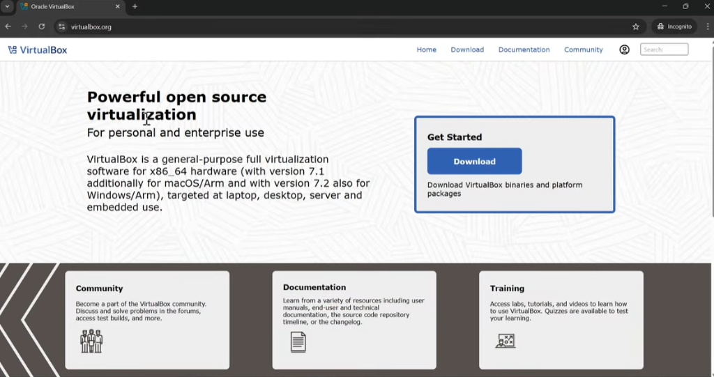
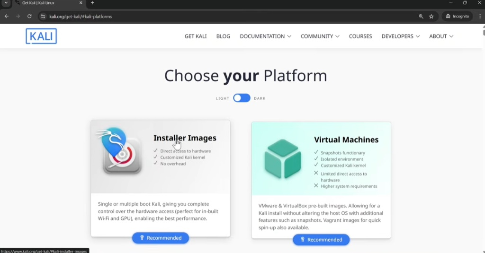
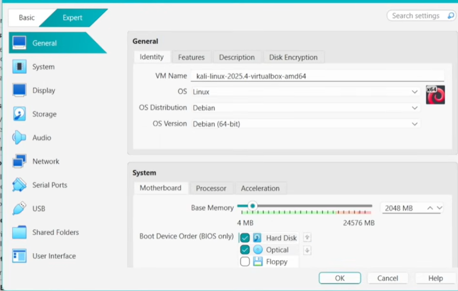
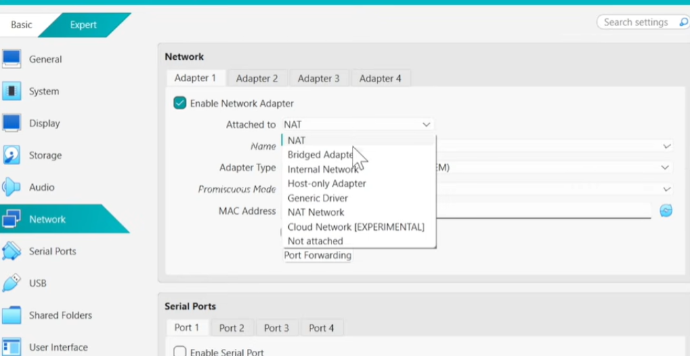
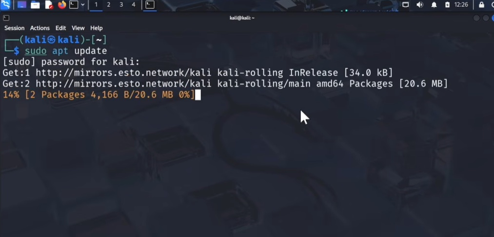

# NETWORKWALKS-ADEBAYO-TIMOTHY-B083-WK1-PM1-CYBERSECURITY-LAB-SETUP

# Cybersecurity Lab Setup Guide

A step-by-step guide to building a isolated Kali Linux penetration testing lab environment.

## Prerequisites
* **Host OS:** Windows 10/11, macOS
* **Hypervisor:** VirtualBox or VMware Workstation Player
* **System Specs:** 8GB+ RAM recommended, 50GB available disk space
* **ISO File:** [Kali Linux Installer ISO](https://www.kali.org/get-kali/)
* **VirtualBox:** virtualbox.org


This isolated, controlled sandbox environment is designed for safe cybersecurity education, practical tool experimentation, and authorized security assessments.

Key Capabilities
- Network Reconnaissance & Discovery: Mapping active hosts, identifying live services, and auditing network perimeters.
- Vulnerability Assessment: Uncovering system misconfigurations and software vulnerabilities.
- Packet & Traffic Analysis: Capturing, inspecting, and analyzing network protocols in real time.
- Web Security Testing: Auditing web applications for common vulnerabilities like SQLi, XSS, and misconfigured access controls.
- Exploitation & Tooling: Practicing offensive methodologies and experimenting with security frameworks.


# LAB SETUP GUIDE

### Step 1: Download VirtualBox Hypervisor



1. Open a web browser and navigate to the official VirtualBox download page at [virtualbox.org](https://www.virtualbox.org).
2. Click the blue **Download** button located inside the **Get Started** box.
3. Select the installation package corresponding to your host operating system (e.g., *Windows hosts*, *macOS / Arm*, or *Linux distributions*) to download the installer file.

### Step 2: Select Kali Linux Platform



1. Navigate to the official Kali Linux download page at [kali.org/get-kali](https://www.kali.org/get-kali/).
2. On the **Choose your Platform** section, click on the **Installer Images** card.
3. This option allows you to download the standard ISO image file for a complete manual installation inside VirtualBox.

### Step 3: Configure VM General and System Settings



1. Open the Virtual Machine **Settings** window.
2. In the **General** section under the **Identity** tab:
   * **VM Name:** Enter a descriptive name (e.g., `kali-linux-2025.4-virtualbox-amd64`).
   * **OS:** Select **Linux**.
   * **OS Distribution:** Select **Debian**.
   * **OS Version:** Select **Debian (64-bit)**.
3. In the **System** section under the **Motherboard** tab:
   * **Base Memory:** Allocate at least **2048 MB** (2 GB) of RAM.
   * **Boot Device Order:** Ensure **Hard Disk** and **Optical** are enabled.
4. Click **OK** to save your VM configuration.

### Step 4: Configure VM Network Adapter



1. In the VM Settings menu, navigate to the **Network** section from the left sidebar.
2. Under the **Adapter 1** tab, verify that **Enable Network Adapter** is checked.
3. Click the **Attached to:** dropdown menu and select **NAT** (default for outbound internet access) or **NAT Network** / **Host-only Adapter** (for isolated multi-VM testing).
4. Click **OK** to finalize and save the network configuration.

### Step 5: Launch and Access the Kali Linux Desktop


1. Start the virtual machine from VirtualBox and complete the initial OS boot sequence.
2. Log in using your credentials created during installation (or default credentials `kali` / `kali` if using a pre-built image).
3. Confirm successful boot into the XFCE desktop environment, where you can access pre-installed security utilities via the top application menu and open the terminal icon to begin testing.

### Step 6: Update the Package Repository Index



1. Open the terminal emulator from the top panel or press `Ctrl + Alt + T`.
2. Run the command to refresh the package repository cache:
   ```bash
   sudo apt update
